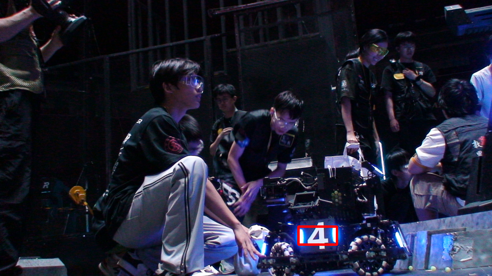
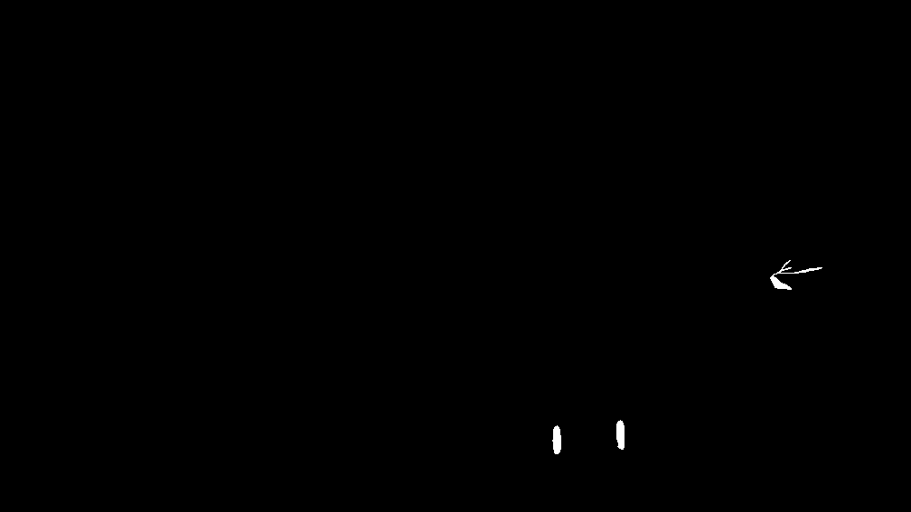

## opencv任务
每个步骤结果图片已保存至./results文件夹下，寻找红色轮廓面积输出截图如下:

### 思路
- 颜色转换和滤波不必多说，均值滤波和高斯滤波均使用3*3滤波核
- 提取红色区域部分，hsv调参的代码放在src/tune.cpp中，分别使用拉杆控制六个参数，最后确定效果比较好的一组，结果为
- 提取高亮区域，先转为hsv格式，筛选V大于200的区域，可以认为是高亮区域，之后的形态学操作也不用说

初版代码由AI完成，我逐个debug了所有结果，在这之上有删减和修改，除了找bbox有点不清楚什么意思，其余应该满足任务要求。

## 识别装甲板任务
结果如下:

### 思路
首先尝试了hsv提取，但是背后的灯条，衬衫会造成干扰，鲁棒性较差。

首先灰度化，二值化，保留亮度较强的区域，这时候有很多碎块，用面积筛一轮，剩下一些面积差不多的，如下图：

最后想用形状筛，但是效果不太理想，因为灯条近似于一个矩形，所以我们先为每个像素块找个框，判断框大小即可找到灯条位置(因为噪音大多是不规则的，虽然总面积接近，但是框面积就会很大，类似于信噪比)。
