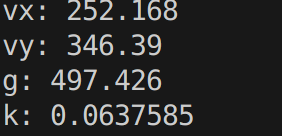
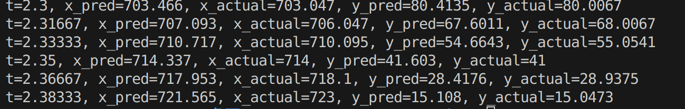

## 结果
最后拟合出来结果如下：

和GT对比：

## 弹道拟合思路
首先要构造数据，根据mp4,在每一帧上识别小球中心位置，记录此时的t（单位s），x（pix），y（pix），构成三个数组作为数据集。 这一步可以思考，必须要每一帧都提取吗？如果改成隔一帧取一次对精度影响高不高。

接下来要定义我们要求的参数，分别是vx，vy，g，k

接下来构造损失函数，这一步有两种做法，一种是把x方向初速度和y方向初速度分别建模，相当于解两个最小二乘问题；另一种是对vx和vy进行联合建模，用xy方向损失和作为总损失吗？还是其他形式（乘积，加权和）

最后套公式即可
